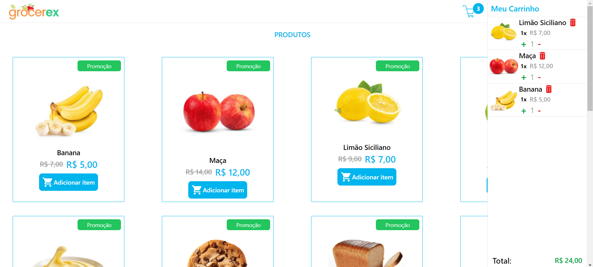
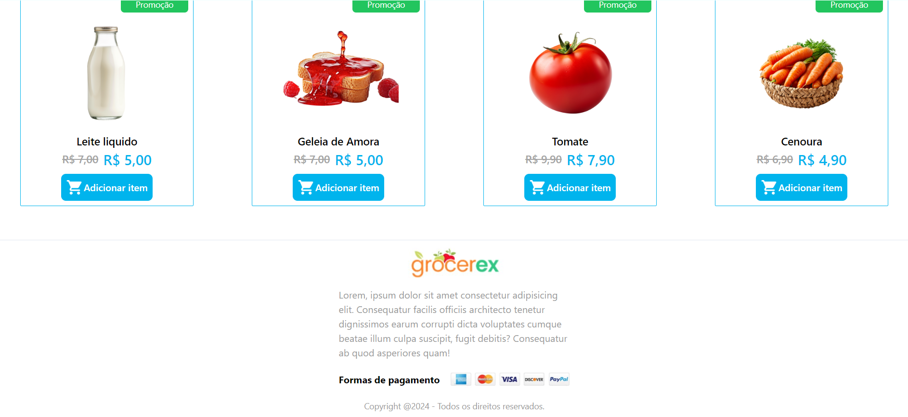

# React TS + Redux + Toolkit 💙

Mini projeto de ecommerce implementando React redux utilizando a biblioteca toolkit.

## Algumas Fotinhas ;)

### Home

### Home

  

### 👩🏽‍💻 Desenvolvido por Talita Araujo

  
  

